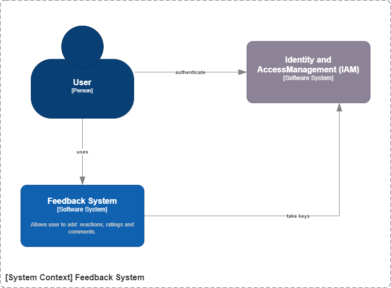
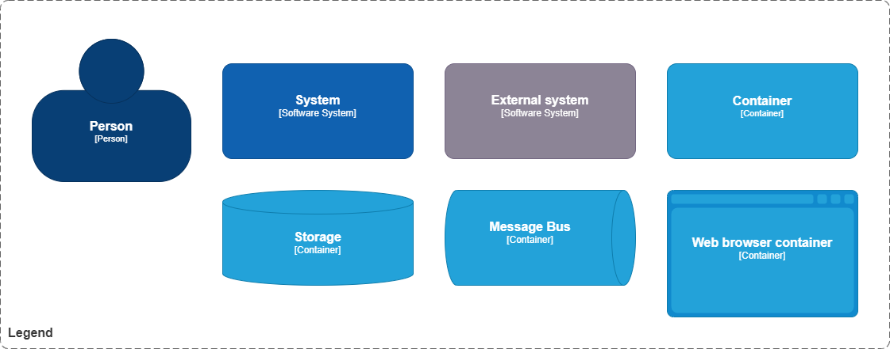
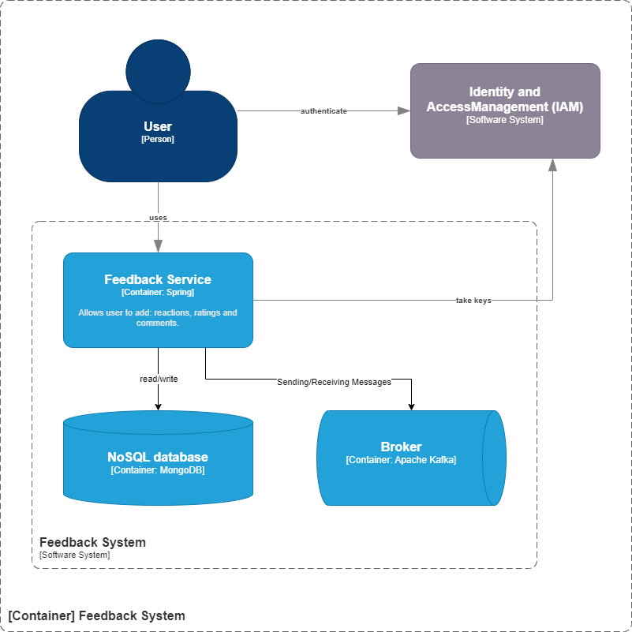
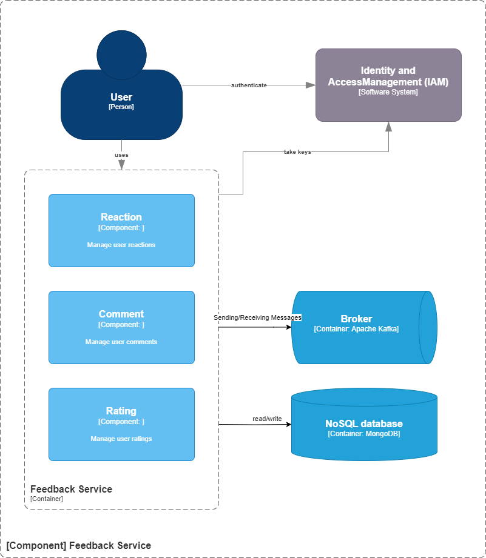
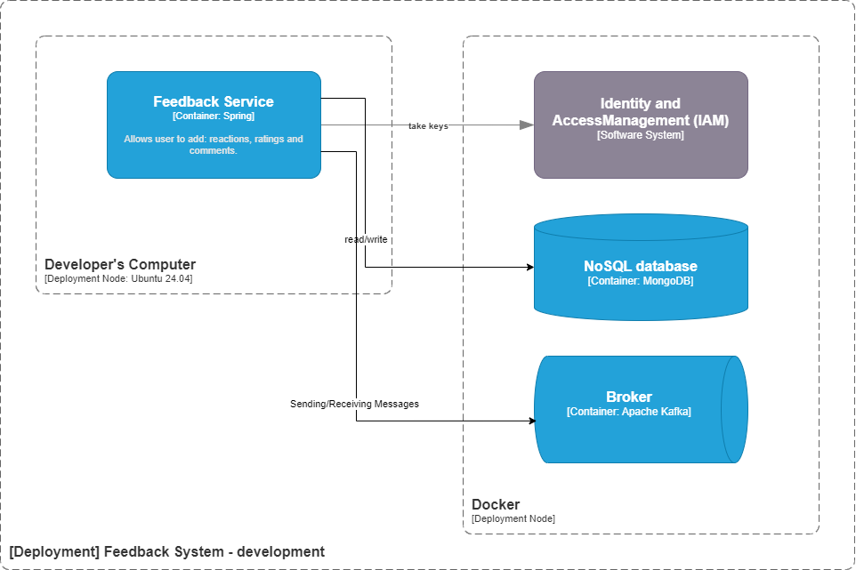

# Text-to-Speech System Architecture
_This document outlines the architectural blueprint for system, providing a structured and comprehensive overview of its design, components, and operational considerations. 
The report leverages the arc42 template for its standardized, pragmatic structure and integrates the C4 model for clear, hierarchical visual representations of the architecture._

The Feedback System is a microservice designed to manage user feedback data, including reactions, ratings, and comments. Its core components include a REST API for managing feedback on domain objects, and a comprehensive security model that leverages Keycloak as an identity provider.

# Table of Contents
1. [Introduction and Goals](#1-introduction-and-goals)
2. [Architecture Constraints](#2-architecture-constraints)
3. [System Scope and Context](#3-system-scope-and-context)
4. [Solution Strategy](#4-solution-strategy)
5. [Building Block View](#5-building-block-view)
6. [Runtime View](#6-runtime-view)
7. [Deployment View](#7-deployment-view)
8. [Crosscutting Concepts](#8-crosscutting-concepts)
9. [Architecture Decisions](#9-architecture-decisions)
10. [Quality Requirements](#10-quality-requirements)
11. [Risks and Technical Debt](#11-risks-and-technical-debt)
12. [Glossary](#12-glossary)
12. [Attachments](#13-attachments)

# 1. Introduction and Goals
_This section establishes the foundational context for the system, defining its purpose, identifying stakeholders, and outlining the quality attributes that guide its design._

## 1.1. Requirements Overview

The primary functional requirements of the Feedback System involve:
- Managing user reactions (e.g., LIKE, DISLIKE) to domain objects.
- Managing user ratings (numerical scores from 1 to 5) on domain objects.
- Managing user comments, including creation, updates, soft deletion, and moderation features like reporting.

## 1.2. Quality Goals
The top quality attributes for the System are critical drivers for its architectural design. These include:
- Availability over consistency to ensure feedback functionality is consistently accessible. 
- Scalability to support a growing number of data. 
- Strong security for user data and access control through fine-grained permissions. 

## 1.3. Stakeholders
| Name      | Describtion                                                   | Primary Sections of Interest  |
| --------  | -------                                                       | -------                       | 
| End-User  | System functionality                                          | 1, 3.1, 6                     |
| Developer | Code structure, APIs, integration points, implementation      | 4, 5, 6, 8, 9, 11             |
| DevOps    | Deployment, infrastructure, monitoring, scalability           | 5, 6, 7, 8, 10, 11            |

# 2. Architecture Constraints
_This section delineates the significant limitations and restrictions that exert influence over the architectural design and subsequent implementation of the system._

- The system must function as a microservice, promoting loose coupling between services.
- It must use standard protocols such as OAuth2 and OpenID Connect to ensure security.

# 3. System Scope and Context
_This section precisely defines the boundaries of the system and illustrates its interactions with external sytems._

## 3.1. Business Context
The business context describes the system as a black box, illustrating its interactions with various users and other systems in its environment.




# 4. Solution Strategy
_This section provides a high-level summary of the fundamental architectural decisions and guiding principles that shape the system's design._

| Goal                    | Description                                                                                                                                                                                                         |
|-------------------------|---------------------------------------------------------------------------------------------------------------------------------------------------------------------------------------------------------------------|
| microservices approach  | The overall architectural style adopted for the system leans towards a microservices approach. This choice supports key design principles such as an API-first approach, promoting loose coupling between services. |
| security                | Keycloak was chosen for robust identity management, leveraging its support for standard protocols like OAuth2 and OpenID Connect.                                                                                   |

# 5. Building Block View
_This section describes the static decomposition of system into its major software components, referred to as building blocks, and illustrates their relationships._

This diagram depicts the main systems: Feedback System and IAM.


| System                                      | Description                                                |
|---------------------------------------------|------------------------------------------------------------|
| Feedback System                             | Main system                                                |
| Identity and Access Management (IAM) system | System responsible for authentication and user management. |

## 5.1. Level 1: Container Level - Feedback System
The Feedback System is a microservice that provides feedback capabilities for various "domain objects" within a larger ecosystem. A domain object is a target entity identified by a domainObjectType (e.g., "POST") and a domainObjectId (a unique ID within that type). The system allows users to express their opinions through reactions, ratings, and comments.
- A Reaction is an interaction like 'LIKE' or 'DISLIKE'.
- A Rating is a numerical score from 1 to 5.
- A Comment is a text message attached to a domain object.

The system serves as a Resource Server, utilizing scopes to manage access permissions for these feedback types.


This diagram provides a clear overview of the system's major deployable units and their communication pathways.




| Containers       | Description                                          |
|------------------|------------------------------------------------------|
| Feedback Service | Allows user to add: reactions, ratings and comments. |
| NoSQL database   | Store data                                           |
| Broker           | To send and receive messages                         | 

### 5.1.1. Level 2: Component Level - Feedback Service
Provides system functionality to user.
Project is on [Github](https://github.com/dawidbladek0831/f22-feedback)



#### 5.1.1.1. Design
To model the domain, the DDD (Domain-Driven Design) approach was applied, complemented by Event Storming. More information in [Attachments](#13-attachments).

#### 5.1.1.2. REST API documentation
Comprehensive documentation for the REST API can be accessed via the following [link](https://www.postman.com/dawidbladek0831/f22).

#### 5.1.1.3. Components
The service breaks down in 3 components:
- Rating Component
- Reactions Component
- Comments Component


#### 5.1.1.3.1 Level 3: Code Level - Rating Component
The Ratings API provides endpoints for managing user ratings
```
GET /ratings?userId={userId}&objectType={domainObjectType}&objectId={domainObjectId} - retrieve a user's ratings -> RATING DTO[]
POST /ratings - create a new rating -> RATING DTO
DELETE /ratings - delete a rating

GET /objects/{domainObjectType}/{domainObjectId}/ratings - retrieve the aggregate rating for a domain object -> DOMAIN OBJECT RATING READ MODEL
GET /users/{userId}/ratings - retrieve all ratings from a specific user -> RATIONG DTO[] - ratings from USER RATING READ MODEL
```

Domain Model
```json
// RATING - DOMAIN MODEL
{
  "id": "string (UUID)",
  "domainObjectType": "string (e.g., 'POST')",
  "domainObjectId":"string (external ID)",
  "userId":"string (external ID)",
  "rating":"integer",
}
```

Read Models
```json
// DOMAIN OBJECT RATING - READ MODEL
{
  "id": "string (UUID)",
  "domainObjectType": "string (e.g., 'POST')",
  "domainObjectId":"string (external ID)",
  "rating":"integer (sum divided by quantity)",
  "sum":"integer",
  "quantity": "integer"
}

// USER REACTIONS - READ MODEL
{
  "userId":"string (external ID)",
  "reactions":[
    {
      "id": "string (UUID)",
      "domainObjectType": "string (e.g., 'POST')",
      "domainObjectId":"string (external ID)",
      "userId":"string (external ID)",
      "rating":"integer",
    },
  ]
}
```

#### 5.1.1.3.2 Level 3: Code Level - Reactions Component
The Reactions API provides endpoints for managing user reactions
```
GET /reactions?userId={userId}&objectType={domainObjectType}&objectId={domainObjectId} - retrieve reactions -> REACTION DTO[]
POST /reactions - create a new reaction -> REACTION DTO
DELETE /reactions - delete a reaction

GET /objects/{domainObjectType}/{domainObjectId}/reactions - retrieve reactions for a specific domain object -> DOMAIN OBJECT REACTION DTO
GET /users/{userId}/reactions - retrieve all reactions from a specific user -> REACTION DTO[] - reactions from USER REACTION - READ MODEL
```

Domain Model
```json
// REACTION - DOMAIN MODEL
{
	"id": "string (UUID)", 
	"domainObjectType": "string (e.g., 'POST')",
	"domainObjectId":"string (external ID)",
	"userId":"string (external ID)",
	"reactions":["string (e.g., 'LIKE', 'AWSOME')"]
}
```

Read Models
```json
// DOMAIN OBJECT REACTION - READ MODEL
{
	"id": "string (UUID)", 
	"domainObjectType": "string (e.g., 'POST')",
	"domainObjectId":"string (external ID)",
	"reactions":[
		"string (e.g., 'LIKE', 'AWSOME')": "ingeter (number of reactions)",
	]
}

// USER REACTION - READ MODEL
{
	"userId":"string (external ID)",
	"reactions":[
		{
			"id": "string (UUID)", 
			"domainObjectType": "string (e.g., 'POST')",
			"domainObjectId":"string (external ID)",
			"userId":"string (external ID)",
			"reactions":["string (e.g., 'LIKE', 'AWSOME')"]
		}
	]
}
```


#### 5.1.1.3.3 Level 3: Code Level - Comments Component

The Comments API provides endpoints for managing user comments
```
GET /comments?userId={userId}&objectType={domainObjectType}&objectId={domainObjectId} - retrieve a comments -> COMMENT DTO[]
POST /comments - create comment -> COMMENT DTO
PATCH /comments - update comment -> COMMENT DTO
DELETE /comments/{commentId} - soft delete comment
GET /objects/{domainObjectType}/{domainObjectId}/comments - retrieve comments for a domain object -> DOMAIN OBJECT COMMENT - READ MODEL

POST /comments/{commentId}/hides - hide a comment
POST /comments/{commentId}/restorations - restore a hidden comment

POST /comments/{commentId}/reports - create a report for a comment -> REPORT DTO
POST /comments/{commentId}/reports/{reportId}/rejections - reject a report -> REPORT DTO
POST /comments/{commentId}/reports/{reportId}/approvals - approve a report -> REPORT DTO
```
Domain Model
```json
// COMMENT - DOMAIN MODEL
{
  "id": "string (UUID)",
  "domainObjectType": "string (e.g., 'POST', 'PRODUCT', 'ARTICLE')",
  "domainObjectId": "string (external ID)",
  "userId": "string (external ID)",
  "content": "string (the actual comment text)",
  "parentId": "string (UUID of the parent comment, null for top-level comments)",
  "state": "string ('PUBLISHED', 'HIDDEN')"
}
```

Read Models
```json
// DOMAIN OBJECT COMMENT - READ MODEL
{
  "id": "string (UUID)",
  "domainObjectType": "string (e.g., 'POST', 'PRODUCT', 'ARTICLE')",
  "domainObjectId": "string (external ID)",
  "comments":[]
}
```


## 5.2. Level 1: Container Level - Identity and Access Management (IAM) System
The system integrates Keycloak as the Identity and Access Management (IAM) solution, eliminating the need to develop custom authentication and authorization mechanisms. This choice reduces development effort, enhances security, and ensures compliance with modern authentication standards like OAuth2 and OpenID Connect.


# 6. Runtime View
_This section details the dynamic behavior of the system by illustrating how its building blocks interact over time to fulfill key use cases and scenarios._

# 7. Deployment View
_This section shows the technical infrastructure where the System is deployed._

# 7.1. Development environment


## 7.1.1. Setup infrastructure 
### Kafka

    $ docker compose -p f22 -f ./.docker/docker-compose-kafka.yaml up -d

### Mongo

    $ docker compose -p f22 -f ./.docker/docker-compose-mongo.yaml up -d

## 7.1.2. Setup external systems
### IAM
Run keycloak and dedicated postgres database:

    $ docker compose -p f22 -f ./.docker/docker-compose-auth.yaml up -d

Config realm
- Create realm using file ./.config/realm-export.json

## 7.1.3. Feedback Service
### 7.1.3.1. Running
#### Development
Build everything 

    $ .\gradlew service:file-storage:build

Start application:

    $ .\gradlew service:file-storage:bootRun

#### Docker
In some development workflows, it might be preferable to run just image.

    $ docker run -p 8080:8080 ghcr.io/dawidbladek0831/feedback:latest

### 7.1.3.2. Dockerization 
The Service can be containerized by building a Docker image. The project's Dockerfile is located in the .docker/Dockerfile path.

To build the Docker image, the docker buildx build command is utilized.

    $ sudo docker buildx build . -f .docker/Dockerfile -t ghcr.io/dawidbladek0831/feedback:latest

To change image's tag to corresponding version

    $ docker tag ghcr.io/dawidbladek0831/feedback:latest ghcr.io/dawidbladek0831/feedback:1.0.0

To push image to registy:

    $ docker push ghcr.io/dawidbladek0831/feedback:latest


# 8. Crosscutting Concepts
_This section describes overarching principles and patterns that are relevant across multiple parts of the System._

## 8.1 Reaction Business Polices
This section describes a set of rules and policies that govern the process of creating and modifying reactions, ensuring consistency and adherence to the system's business logic.
- **Allowed Domain Object Types Reaction Policy**: A user can only add a reaction to a predefined, allowed domain object types to maintain data integrity.
- **Allowed Reactions Policy**: A user can only use specific reaction types (e.g., 'LIKE', 'DISLIKE', 'UNICORN') that are defined within the system.
- **Reaction Creating Policy**: A new reaction is created only if the user has not yet had a reaction to the given object.
- **Single Reaction Policy:** A user can only have one active reaction per object at any given time.
- **Like/Dislike Reaction Policy**: A user cannot simultaneously have both 'LIKE' and 'DISLIKE' reactions on the same object

## 8.2 Rating Business Polices
This section describes a set of rules and policies that govern the process of creating and modifying ratings, ensuring consistency and adherence to the system's business logic.
- **Allowed Domain Object Types Rating Policy**: A user can only add a rating to a predefined, allowed domain object type to maintain data integrity.
- **Range Rating Policy**: A user can only provide a rating within a selected range (e.g., 1 to 5).
- **Creating Rating Policy**: A new rating is created only if the user has not yet rated the given object.
- **Updating Rating Policy**: An existing rating is updated when a user submits a new rating for an object they have already rated.

## 8.3 Authentication and Authorization
The system functions as a Resource Server and integrates Keycloak as the Identity and Access Management (IAM) solution. This approach eliminates the need for custom authentication and authorization mechanisms, leveraging standard protocols like OAuth2 and OpenID Connect. The system's security model is based on scopes, where specific roles grant access to corresponding scopes.

The table below presents the basic roles required to obtain the corresponding scopes. For example, to obtain the scope `fs.rating:read`, the `fss.rating-read` role must be assigned.


| Base role                | Scope                     | Access Granted                                        |
|--------------------------|---------------------------|-------------------------------------------------------|
| fs.rating-read           | fs.rating:read            | Permission to read any rating.                        |
| fs.rating-write          | fs.rating:write           | Permission to create, change or delete own rating.    |
| fs.rating-manage         | fs.rating:manage          | Permission to create, change or delete any rating.    |
|                          |                           |                                                       |
| fs.reaction-read         | fs.reaction:read          | Permission to read any reaction.                      |
| fs.reaction-write        | fs.reaction:write         | Permission to create, change or delete own reaction.  |
| fs.reaction-manage       | fs.reaction:manage        | Permission to create, change or delete any reaction.  |
|                          |                           |                                                       |
| fs.comment-read          | fs.comment:read           | Permission to read any comment.                       |
| fs.comment-write         | fs.comment:write          | Permission to create, change or delete own comment.   |
| fs.comment-moderate      | fs.comment:moderate       | Permission to hide or restore comment.                |
| fs.comment-manage        | fs.comment:manage         | Permission to create, change or delete any comment.   |
|                          |                           |                                                       |
| fs.comment-report-read   | fs.comment.report:read    | Permission to read any comment's report.              |
| fs.comment-report-write  | fs.comment.report:write   | Permission to create comment's report.                |
| fs.comment-report-manage | fs.comment.report:manage  | Permission to approve or reject comment's report.     |

To simplify role management, higher-level roles like fs.admin, fs.moderator, and fs.user aggregate these basic roles.


| Base role\Role           | fs.admin  | fs.moderator  | fs.user |
|--------------------------|-----------|---------------|---------|
| fs.rating-read           | +         | +             | +       |
| fs.rating-write          | +         | +             | +       |
| fs.rating-manage         | +         | -             | -       |
|                          |           |               |         |
| fs.reaction-read         | +         | +             | +       |
| fs.reaction-write        | +         | +             | +       |
| fs.reaction-manage       | +         | -             | -       |
|                          |           |               |         |
| fs.comment-read          | +         | +             | +       |
| fs.comment-write         | +         | +             | +       |
| fs.comment-moderate      | +         | +             | -       |
| fs.comment-manage        | +         | -             | -       |
|                          |           |               |         |
| fs.comment-report-read   | +         | +             | -       |
| fs.comment-report-write  | +         | +             | +       |
| fs.comment-report-manage | +         | +             | -       |


# 9. Architecture Decisions
_Architectural decisions are made with specific trade-offs and constraints in mind._
## 9.1. Architecture Decision Record Template

    Data: 2025-7-28
    
    Status: Accepted
    
    Context: We need to record the architectural decisions made on this project.

    Decision: template from article:
    https://www.cognitect.com/blog/2011/11/15/documenting-architecture-decisions

    Consequences: From now we will use Nygard's template, link above.


## 9.2. Decision: Using Keycloak for Identity Management

    Data: 2025-8-4

    Status: Accepted

    Context: The system requires robust user authentication and authorization, support for standard protocols (OAuth2, OpenID Connect), and centralized user management capabilities.

    Decision: Integrate Keycloak as the primary identity provider for user authentication and authorization.

    Consequences:

        Easier: Leverages a mature, open-source solution for secure authentication, supports industry-standard protocols, provides a comprehensive administration console for user management, and enables future SSO capabilities.

        Harder: Requires Keycloak setup, configuration, and ongoing maintenance, introduces a learning curve for developers to integrate with OAuth2/OpenID Connect flows, and adds another component to the system's operational footprint.

# 10. Quality Requirements
_This section details the measurable quality scenarios for the System._

# 11. Risks and Technical Debt
_This section identifies known problems, potential risks, and accumulated technical debt within the System._

# 12. Glossary
_This section defines important business and technical terms used throughout the documentation to ensure consistent understanding and reduce ambiguity._

| Term                               | Describtion                                                                                                                                                                                                                                                    |
|------------------------------------|----------------------------------------------------------------------------------------------------------------------------------------------------------------------------------------------------------------------------------------------------------------|
| ADR (Architecture Decision Record) | A document that captures an important architectural decision made along with its context, options, and consequences.                                                                                                                                           |
| C4 Model                           | A visual notation technique for documenting software architecture at different levels of abstraction: Context, Container, Component, and Code.                                                                                                                 |
| OAuth2 / OpenID Connect            | Industry-standard protocols used by Keycloak for secure authorization and authentication.                                                                                                                                                                      | 
| Domain Object                      | A Domain Object is a target entity in system. It is identified by:  `domainObjectType` (e.g. `"POST"`) and `domainObjectId` (unique identifier within that type). In practice, `domainObjectType` + `domainObjectId` form the global identifier of the target. |
| Reaction                           | A Reaction represents a user’s interaction (like LIKE, DISLIKE, UNICORN, etc.) with a domain object. Interaction expresses the user's emotional or functional reaction to something in the system. E.g. User added a LIKE reaction to POST-123.                |
| Rating                             | A Rating represents a user's evaluation of a specific domain object, typically as a numerical score from 1 to 5. E.g. User rated POST-123 with a 4.                                                                                                            |
| Comment                            | A Comment represents a user text message attached to a specific domain object.  E.g. User posted comment on POST-123 with message "Interesting".                                                                                                               |

# 13. Attachments
Event Storming - [event-storming.md](event-storming.md)