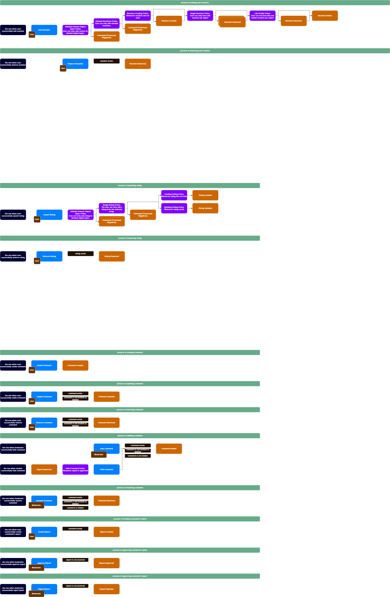

To model the domain, the DDD (Domain-Driven Design) approach was applied, complemented by Event Storming. Event Storming is an excellent tool for supporting DDD processes, particularly during the exploratory and design phases. It facilitates the identification of domain events, the modeling of business processes, and the development of a shared language among all stakeholders.
Event Storming is created using draw.io, and the corresponding file is located in the designated folder(./f18.drawio).

# Strategic Design (ES: Pig Picture & Process Modeling)

During modeling, the following definitions were established as universal concepts, applicable across all bounded contexts within the domain:
- A Domain Object is a target entity in system. It is identified by:  `domainObjectType` (e.g. `"POST"`) and `domainObjectId` (unique identifier within that type). In practice, `domainObjectType` + `domainObjectId` form the global identifier of the target;
- A Reaction represents a user’s interaction (like LIKE, DISLIKE, UNICORN, etc.) with a domain object. Interaction expresses the user's emotional or functional reaction to something in the system. E.g. User added a LIKE reaction to POST-123;
- A Rating represents a user's evaluation of a specific domain object, typically as a numerical score from 1 to 5. E.g. User rated POST-123 with a 4;
- A Comment represents a user text message attached to a specific domain object.  E.g. User posted comment on POST-123 with message "Interesting";

## ES. Legend

## ES Pig Picture

## ES. Process Modeling:

# Tactical Design (ES: Design Modeling)

After documenting and describing the processes, the following bounded contexts were identified: **Feedback bounded context**. 
With 3 subdomains:
- **Rating Subdomain** - implemented in Port & Adapters architectural patter as Domain Model,
- **Reaction Subdomain** - implemented in Port & Adapters architectural patter as Domain Model, and
- **Comment Subdomain** implemented in Port & Adapters architectural patter as Domain Model.